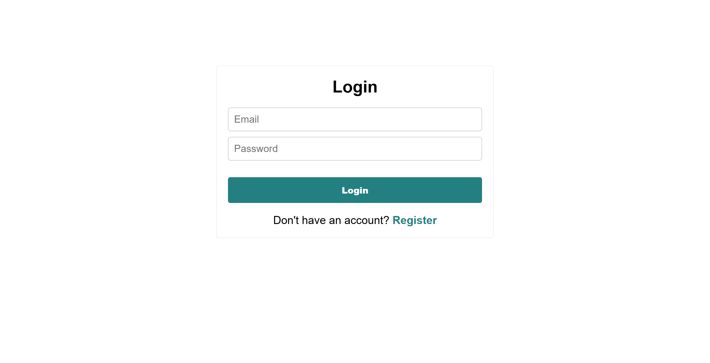
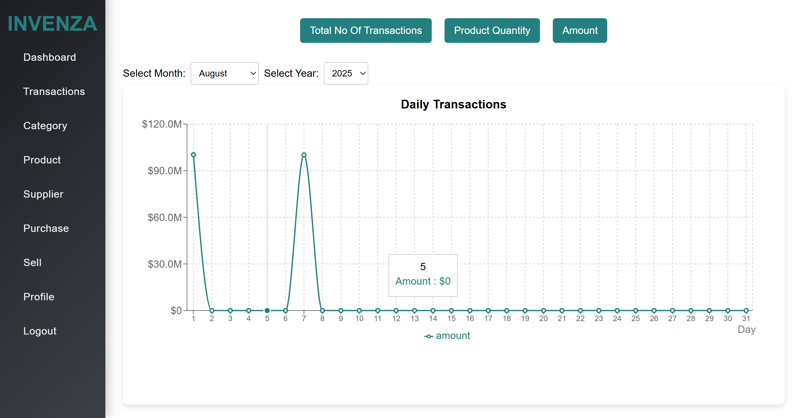
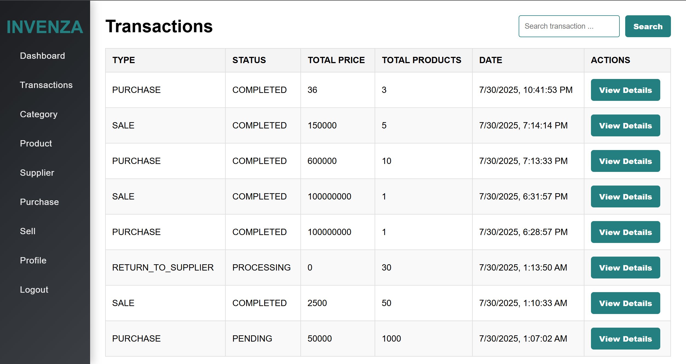

# INVENZA
A full-stack Inventory Management System built using React.js + CSS (frontend) and Spring Boot + MySQL (backend). This system allows store admins to manage products, suppliers, categories, purchases, and sales with support for JWT-based role authentication and image upload support.

# 🔍 Overview
- 📦 Helps businesses track stock levels in real-time.

- 👥 Manages both suppliers and customers efficiently.

- 🧾 Keeps record of purchase and sales transactions.

- 📊 Provides visual analytics dashboards to track trends.

- ⚡ Offers a beautiful and intuitive UI built with React and CSS.

- 🔄 Enables real-time updates across the system on every transaction.

- 🖼️ Supports image uploads for products stored locally.
  

# 🗂️ Project Structure
```bash
          Invenza/
                 ├── backend/ # Spring Boot backend
                 ├── frontend/ # React.js frontend 
```

# ⚙️ How It Works
The Inventory Management System is a full-stack web application that enables users (especially admins) to manage inventory through a seamless integration of frontend, backend, and database layers.

## 1. 🔐 Authentication & Authorization (JWT)

- Users log in using credentials through a secure login form.

- The backend validates the credentials and issues a JWT (JSON Web Token).

- This token is stored in the browser’s local storage.

- All protected API requests include the token in the Authorization header.

- The Spring Boot backend uses filters to:

- Validate the token.

- Extract user roles (e.g., ADMIN, USER).

- Grant or deny access based on permissions.

## 2. 🖥️ Dashboard
- Once logged in, users see a dashboard that shows:

- Total products in inventory.

- Total purchases and sales.

- Graphs/Charts for monthly trends (using Recharts or similar).

- Data is fetched from the backend using Axios and updated in real time.

## 3. 📦 Product Management
Admins can add, edit, or delete products.

**Product fields:**

- Name

- Category

- Quantity

- Unit Price

- Image

**When an image is uploaded:**

- It is sent via multipart/form-data to the backend.

- The image is stored in the /frontend/public/products/ folder.

- The filename (usually a UUID) is stored in the database.

- The frontend loads the image using a static path like /products/filename.jpg.

## 4. 🗂️ Category & Supplier Management
Categories group similar products (e.g., Electronics, Groceries).

- Suppliers store information such as:

- Supplier name

- Contact details

- Associated products

- Users can add, edit, and delete categories and suppliers via forms.

## 5. 🧾 Purchases & Sales

➕ **Purchases:**
A purchase form allows admins to:

- Select a product and supplier.

- Enter the quantity purchased.

**On submission:**

- The product’s quantity in stock is increased.

- A transaction record is created.

**➖ Sales:**
A sales form allows:

- Selecting a customer and product.

- Entering quantity sold.

- Recording sales notes.

**On submission:**

- The product’s stock is reduced.

- A transaction record is stored.

## 6. 📈 Analytics & Reporting
The system uses charts (e.g., LineChart, BarChart) to visualize:

- Sales trends by month.

- Purchase vs. sales volume.

- Current inventory levels.

- Useful for business decision-making.

## 7. 🔄 Real-Time Updates
- When a product is added, updated, or sold:

- The backend updates the database.

- The frontend fetches fresh data via Axios and updates the UI immediately.

## 8. 🧩 Tech Stack Summary
- Layer	Technology
- Frontend	React.js, CSS, Axios
- Backend	Spring Boot (Java), JWT
- Database	MySQL
- Image Store	Public folder (/products/)
- Auth	Token-based (JWT)

## 📸 Screenshots

### 🔐 Login Page


### 📊 Dashboard


### 📦 Product List


### ➕ Transactions page


# 🚀 Getting Started
Follow these steps to set up the Inventory Management System locally.

🔧 **Prerequisites**
Make sure you have the following installed on your machine:

- Node.js (v18+)

- Java JDK (17+)

- MySQL Server

- Maven

🖥️ **Backend Setup (Spring Boot)**
Clone the repository (if not already):

```bash

git clone https://github.com/your-username/inventory-management-system.git
cd inventory-management-system/ims-backend
```

**Create MySQL Database:**
```
CREATE DATABASE inventory;
```

**Configure application.properties:**

```
src/main/resources/application.properties
```

Update DB credentials:
```
spring.datasource.url=jdbc:mysql://localhost:3306/inventory
spring.datasource.username=root
spring.datasource.password=your_password
spring.jpa.hibernate.ddl-auto=update
```

Run the application:
```
mvn spring-boot:run
```
The backend will run at: http://localhost:8080


# 🌐 Frontend Setup (React + Vite + Tailwind)
Open a new terminal:

```
cd inventory-management-system/ims-frontend
```


Install dependencies:
```
npm install
npm install axios react-router-dom recharts
```
Run the development server:
```
npm run dev
```
The frontend will be available at: http://localhost:3000

# 📝 License

This project is licensed under the MIT License.

You are free to use, modify, and distribute this software for personal or commercial purposes, provided that the original license and copyright
notice are included.

See the LICENSE file for full details.


